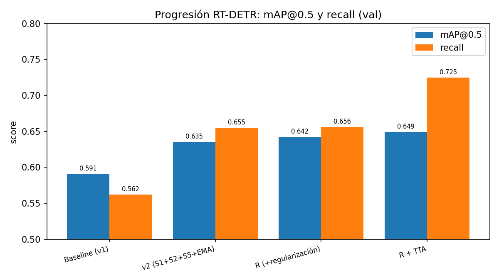
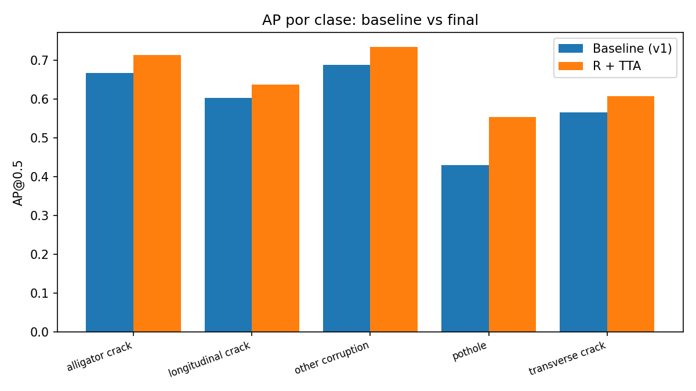

# Resultados — Detección de daños viales con RT-DETR (RDD2022)

> Documento consolidado de resultados para la tesis. Números reproducibles con
> `python -m model.tools.consolidate_results` (lee los `val_evaluation_report.json`).
> Detalle metodológico: [MEJORAS_METRICAS_RT_DETR.md](MEJORAS_METRICAS_RT_DETR.md);
> arquitectura: [ARQUITECTURA.md](ARQUITECTURA.md). Fecha: 2026-06-17.

## 1. Resumen

Partiendo de un RT-DETR-L base (mAP@0.5 = 0.591), una secuencia de mejoras fundamentadas en el
estado del arte llevó el modelo a **mAP@0.5 = 0.649 y recall = 0.725** en validación. El mayor
salto vino de la configuración de pérdida orientada a recall + mayor resolución (v2); la
regularización y el test-time augmentation aportaron mejoras marginales pero reales.

- **mAP@0.5: 0.591 → 0.649** (+0.058, **+9.8 %**)
- **recall: 0.562 → 0.725** (+0.163, **+29 %**)
- **best-F1: 0.596 → 0.626**
- Clase más difícil (**bache/pothole**): AP **0.430 → 0.553** (+0.123, **+29 %**)

## 2. Tabla principal (validación, 5169 imágenes, 4 países)

Evaluación sobre el split de validación (20 %), países Japón/India/EE.UU./Chequia (sin China ni
Noruega). Desde v2 el modelo entrena y evalúa a 768 px.

| Experimento | Cambios | mAP@0.5 | mAP@.5:.95 | precision | recall | F1@0.5 | best-F1 |
|---|---|---:|---:|---:|---:|---:|---:|
| Baseline (v1) | RT-DETR-L @640 | 0.5909 | 0.2964 | 0.6351 | 0.5620 | 0.5963 | 0.5963 |
| v2 | +loss pro-recall, +768px, +LR discr., +EMA | 0.6353 | 0.3246 | 0.5871 | 0.6549 | 0.6191 | 0.6262 |
| R | v2 +weight_decay 5e-4 +random-erasing | **0.6420** | **0.3281** | 0.5809 | 0.6562 | 0.6163 | 0.6258 |
| RC | R +balanceo por clase | 0.6394 | 0.3242 | 0.5563 | 0.6722 | 0.6088 | 0.6231 |
| **R + TTA** | R +test-time augmentation | **0.6490** | 0.3271 | 0.5044 | **0.7249** | 0.5949 | **0.6262** |

> Nota F1: con TTA, el F1 a confianza fija (0.5) baja porque TTA desplaza el punto de operación
> hacia recall; el **best-F1 del barrido es equivalente (0.626)** al re-elegir el umbral (conf 0.60).

## 3. Contribución por cambio (ablación)

| Paso | Δ mAP@0.5 | Lectura |
|---|---:|---|
| v1 → v2 | **+0.044** | El gran salto. `no_object_weight` 0.3→0.1 + `focal_alpha` 0.25 (recall) y 640→768 px (objetos pequeños). |
| v2 → R | +0.007 | Regularización (weight_decay + random-erasing): combate el overfitting observado (~ep16). |
| R → R+TTA | +0.007 | TTA en evaluación (flip + multiescala 640/768/896 + NMS). Sólo inferencia. |
| R → RC | **−0.003** | **Negativo.** El balanceo por clase no ayudó (desbalance leve 2.4×; el cuello de bache es resolución, no frecuencia). |

## 4. AP por clase (@0.5)

| Clase | Baseline (v1) | v2 | R | RC | R+TTA |
|---|---:|---:|---:|---:|---:|
| alligator crack | 0.667 | 0.706 | 0.701 | 0.697 | **0.713** |
| longitudinal crack | 0.603 | 0.632 | 0.637 | 0.635 | **0.637** |
| other corruption | 0.688 | 0.724 | 0.733 | 0.732 | **0.735** |
| **pothole (bache)** | 0.430 | 0.516 | 0.541 | 0.533 | **0.553** |
| transverse crack | 0.566 | 0.598 | 0.598 | 0.599 | **0.607** |

## 5. Desempeño por país (generalización)

mAP@0.5 por país (val). Refleja el desbalance de datos: el modelo rinde mejor donde hay más datos
(Japón) y peor donde hay menos (Chequia, 2.8k imágenes).

| País | imgs train | Baseline (v1) | R | R+TTA |
|---|---:|---:|---:|---:|
| Japan | 10.506 | 0.604 | 0.648 | **0.657** |
| United_States | 4.805 | 0.482 | 0.508 | **0.514** |
| India | 7.706 | 0.347 | 0.471 | **0.481** |
| Czech | 2.829 | 0.266 | 0.300 | **0.328** |

> India tiene muchos datos pero baja mAP → dificultad intrínseca / etiquetas, no cantidad. Chequia
> es el caso data-starved (poca data → menor mAP). El gap Japón↔Chequia sigue siendo la principal
> limitación de generalización.

## 6. Hallazgos y decisiones de diseño (incluye negativos)

1. **Loss orientado a recall (S1)** + **resolución 768 (S2)** = el mayor aporte (+0.044). El recall
   era el cuello (la clase bache perdía >50 % de detecciones).
2. **Mosaic/MixUp perjudican** en daño vial (objetos pequeños; el downscale los destruye) → se
   desactivaron.
3. **China y Noruega excluidos**: incluir China bajaba el mAP (domain shift, imágenes aéreas).
4. **El modelo converge ~época 15-16; entrenar más overfittea** (validado: reanudar empeoró el val
   y disparó el gap train-val). No estaba subentrenado.
5. **EMA** y **LR discriminativo** (backbone 1e-5 / head 1e-4) aportan al lift y estabilizan.
6. **Regularización (R)**: mejora marginal real (+0.007) — el overfitting era recuperable pero poco.
7. **Balanceo por clase (RC): negativo.** El desbalance de clases no era el cuello.
8. **TTA**: +0.007 mAP y +0.069 recall, pero no sube el F1 pico; **6× más lento** → técnica de
   reporte, no de despliegue (el RT-DETR se despliega sin TTA por su requisito de tiempo real).

## 7. Configuración y artefactos

- **Modelo final**: `model/configs/train_rt_detr_v2_R.yaml` (RT-DETR-L, 768px, AdamW, EMA, etc.).
- **Checkpoint final**: `checkpoints/rt_detr_v2_R/b5da089a-ab0e-4f69-b72c-10f28487e056/best_model.pt`
  (pesos EMA, época 15). Eval con TTA: `--tta --tta-scales 0.8333 1.0 1.1667`.
- **Tablas (CSV)**: `results/thesis/resultados_principales.csv`, `resultados_por_clase.csv`.
- **Figuras (PNG)**: `results/thesis/progresion_map_recall.png`, `ap_por_clase.png`.
- **Reproducir tablas/figuras**: `python -m model.tools.consolidate_results`.

## 8. Líneas futuras (no exploradas, mayor techo)

- **Pseudo-labeling** del conjunto de test sin etiquetar (técnica de los ganadores de CRDDC'2022).
- **Más datos / balanceo de Chequia** para cerrar el gap entre países.
- **Ensemble** con una arquitectura distinta (p. ej. YOLO) + Weighted Boxes Fusion.
- **Diagnóstico de India** (data-rica pero difícil): revisar calidad de etiquetas.

> Referencia SOTA: CRDDC'2022 mejor F1 = 0.769 sobre el test oficial de 6 países (no comparable
> directo: aquí se usa un split de validación de 4 países).
